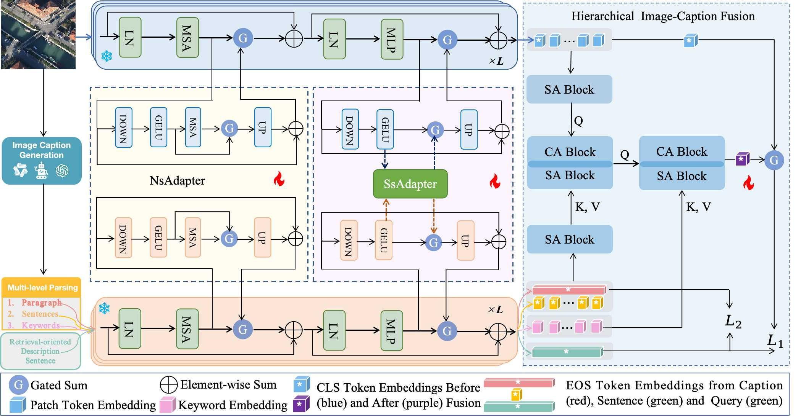

# Caption2CLIP

## Highlights

- **DC-Adapter**: A partially shared attention adapter
- **Multi-scale Text-Image Fusion**: 
  - Hierarchical fusion from three perspectives: 
    - Caption level 
    - Sentence level 
    - Word level
  - Gate sum with original features

## Credit

- 1 AMFMN:  
  - Z. Yuan et al., "Exploring a Fine-Grained Multiscale Method for Cross-Modal Remote Sensing Image Retrieval," in IEEE Transactions on Geoscience and Remote Sensing, doi: 10.1109/TGRS.2021.3078451.
  - https://github.com/xiaoyuan1996/AMFMN
- 2 LongCLIP
  - @article{zhang2024longclip,
        title={Long-CLIP: Unlocking the Long-Text Capability of CLIP},
        author={Beichen Zhang and Pan Zhang and Xiaoyi Dong and Yuhang Zang and Jiaqi Wang},
        journal={arXiv preprint arXiv:2403.15378},
        year={2024}
}
  - https://github.com/beichenzbc/Long-CLIP
- 3 Harma
  - @article{huang2024efficient,
  title={Efficient Remote Sensing with Harmonized Transfer Learning and Modality Alignment},
  author={Huang, Tengjun},
  journal={arXiv preprint arXiv:2404.18253},
  year={2024}
}
  - https://github.com/seekerhuang/HarMA
- 4 RemoteCLIP
  - @article{remoteclip,
  author       = {Fan Liu and
                  Delong Chen and
                  Zhangqingyun Guan and
                  Xiaocong Zhou and
                  Jiale Zhu and
                  Qiaolin Ye and
                  Liyong Fu and
                  Jun Zhou},
  title        = {RemoteCLIP: {A} Vision Language Foundation Model for Remote Sensing},
  journal      = {{IEEE} Transactions on Geoscience and Remote Sensing},
  volume       = {62},
  pages        = {1--16},
  year         = {2024},
  url          = {https://doi.org/10.1109/TGRS.2024.3390838},
  doi          = {10.1109/TGRS.2024.3390838},
}
  - https://github.com/ChenDelong1999/RemoteCLIP